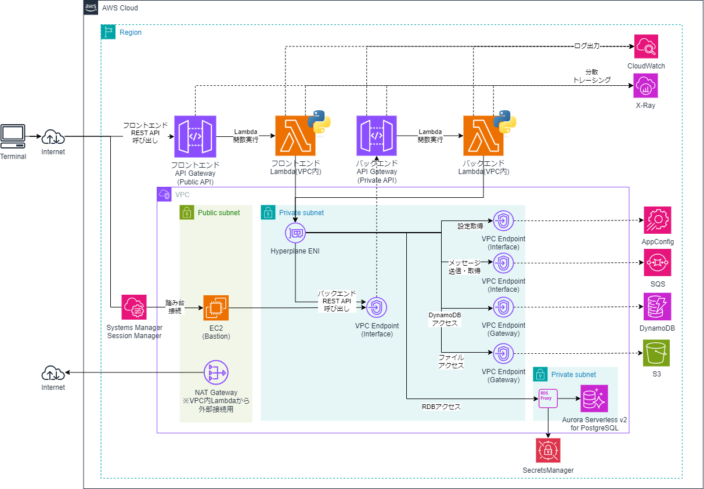
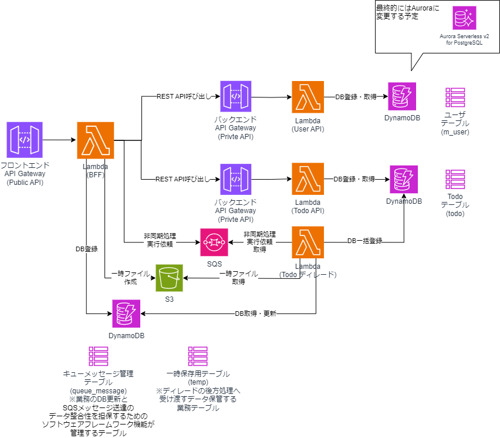
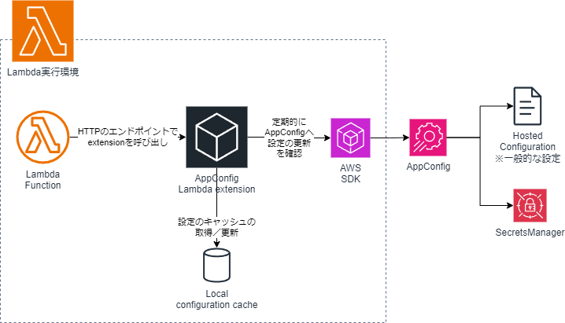
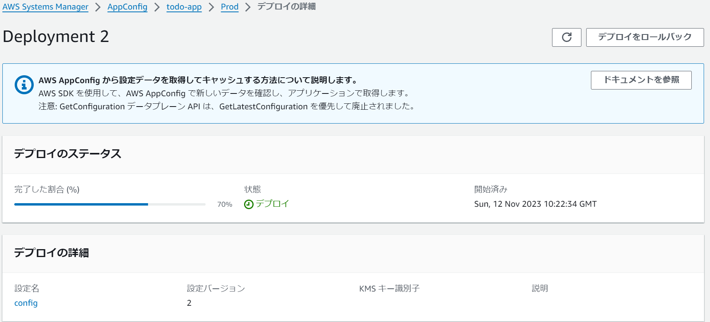

# Lambda/PythonのAWS SAMサンプルAP

> [!NOTE]
> TODO: 全般作成中のため、READMEの記載は今後の想定となります。

## 構成イメージ

* オンラインリアルタイム処理方式
    * API GatewayをトリガにLambda実行
    * フロントエンドは、Regional Public APIで公開し、バックエンドはPrivate APIで公開
        * バックエンドは、動作確認用にVPC内にEC2で構築したBastionからのアクセスにも対応
    * LambdaからDynamoDBやRDS AuroraへのDBアクセスへのアクセスを実現
    * LambdaはVPC内Lambdaとして、RDS Aurora（RDS Proxy経由）でのアクセスも可能とする
        * 最初の段階では、DynamoDBへのアクセスのみから開始する予定

* ディレード処理方式
    * Lambdaから、SQSへのアクセスし、非同期処理の実行依頼を実現
    * SQSトリガにLambda実行
    * 標準キュー、FIFOキューの両方に対応

* LambdaからAWS SDKを用いたDynamoDB、SQS、S3等の各種AWSリソースへのアクセスに対応




* Lambda間の呼び出しイメージ
    * フロントエンド（BFF:Backend For Frontend）からバックエンドの各サービスへアクセスする、SQSを介してディレード実行するという呼び出し関係になっている
    * User API、Todo APIサービスはバックエンドサービス扱いで、bationから直接アクセスできるようにもなっている



* AppConfigによる設定の外部化
    * [AppConfig](https://docs.aws.amazon.com/ja_jp/appconfig/latest/userguide/what-is-appconfig.html)を使用し、APから外部管理された設定の取得、AppConfig機能を使ったデプロイに対応している。
    * マネージドなLambdaレイヤにより提供される[AppConfig Agent Lambdaエクステンション](https://docs.aws.amazon.com/ja_jp/appconfig/latest/userguide/appconfig-integration-lambda-extensions.html)を使って、LambdaアプリケーションからAppConfigの設定をキャッシュするとともに、アプリケーションの再デプロイ不要で設定変更を反映することができる。



* X-Rayによる可視化
    * API Gateway、Lambdaにおいて、X-Rayによる可視化にも対応している
    * RDB（RDS Aurora）、DynamoDBへのアクセス、REST API、SQSの呼び出しのトレースにも対応予定

## 事前準備
* ローカル環境に、Python、AWS CLI、AWS SAM CLI、Docker環境が必要

## 1. IAMの作成
```sh
#cfnフォルダに移動
cd cfn
aws cloudformation validate-template --template-body file://cfn-iam.yaml
aws cloudformation create-stack --stack-name Demo-IAM-Stack --template-body file://cfn-iam.yaml --capabilities CAPABILITY_IAM
```

## 2. VPCおよびサブネット、InternetGateway等の作成
```sh
aws cloudformation validate-template --template-body file://cfn-vpc.yaml
aws cloudformation create-stack --stack-name Demo-VPC-Stack --template-body file://cfn-vpc.yaml
```

## 3. Security Groupの作成
```sh
aws cloudformation validate-template --template-body file://cfn-sg.yaml
aws cloudformation create-stack --stack-name Demo-SG-Stack --template-body file://cfn-sg.yaml
```

## 4. VPC Endpointの作成とプライベートサブネットのルートテーブル更新
* API GatewayのPrivate APIのためのVPC Endpointや、VPC内LambdaからDynamoDB、SQS、AppConfig等へアクセスするためのVPC Endpointを作成
```sh
aws cloudformation validate-template --template-body file://cfn-vpe.yaml
aws cloudformation create-stack --stack-name Demo-VPE-Stack --template-body file://cfn-vpe.yaml
```
## 5. NAT Gatewayの作成とプライベートサブネットのルートテーブル更新
* VPC内Lambdaからインターネットに接続する場合に必要となる。
* hello-worldのサンプルAPでは[https://checkip.amazonaws.com](https://checkip.amazonaws.com)へアクセスしに行くためのみに必要なので、もしhello-worldのサンプルAPの確認が不要な場合は、作成不要。

```sh
aws cloudformation validate-template --template-body file://cfn-ngw.yaml
aws cloudformation create-stack --stack-name Demo-NATGW-Stack --template-body file://cfn-ngw.yaml
```

## 6. RDS Aurora Serverless v2 for PostgreSQL、SecretsManager、RDS Proxy作成
* TODO: まだAP側が使ってないため不要
* リソース作成に少し時間がかかる。(20分程度)
```sh
aws cloudformation validate-template --template-body file://cfn-rds.yaml
aws cloudformation create-stack --stack-name Demo-RDS-Stack --template-body file://cfn-rds.yaml --parameters ParameterKey=DBUsername,ParameterValue=postgres ParameterKey=DBPassword,ParameterValue=password
```

## 7. EC2(Bastion)の作成
* psqlによるRDBのテーブル作成や、APIGatewayのPrivate APIにアクセスするための踏み台を作成
```sh
aws cloudformation validate-template --template-body file://cfn-bastion-ec2.yaml
aws cloudformation create-stack --stack-name Demo-Bastion-Stack --template-body file://cfn-bastion-ec2.yaml
```

* 必要に応じてキーペア名等のパラメータを指定
    * 「--parameters ParameterKey=KeyPairName,ParameterValue=myKeyPair」

## 8. RDBのテーブル作成
* TODO: まだAP側が使ってないため不要
* マネージドコンソールからEC2にセッションマネージャで接続し、Bastionにログインする。psqlをインストールし、DB接続する。
    * 以下参考に、Bastionにpsqlをインストールするとよい
        * https://techviewleo.com/how-to-install-postgresql-database-on-amazon-linux/
* DB接続後、ユーザテーブルを作成する。        
```sh
sudo amazon-linux-extras install -y epel

sudo tee /etc/yum.repos.d/pgdg.repo<<EOF
[pgdg14]
name=PostgreSQL 14 for RHEL/CentOS 7 - x86_64
baseurl=http://download.postgresql.org/pub/repos/yum/14/redhat/rhel-7-x86_64
enabled=1
gpgcheck=0
EOF

sudo yum makecache
sudo yum install -y postgresql14

#Auroraに直接接続
#CloudFormationのDemo-RDS-Stackスタックの出力「RDSClusterEndpointAddress」の値を参照
psql -h (Auroraのクラスタエンドポイント) -U postgres -d testdb    

#ユーザテーブル作成
CREATE TABLE IF NOT EXISTS m_user (user_id VARCHAR(50) PRIMARY KEY, user_name VARCHAR(50));
#ユーザテーブルの作成を確認
\dt
#いったん切断
\q

#RDS Proxyから接続しなおす
#CloudFormationのDemo-RDS-Stackスタックの出力「RDSProxyEndpoint」の値を参照
psql -h (RDS Proxyのエンドポイント) -U postgres -d testdb
#ユーザテーブルの存在を確認
\dt

```

## 9. DynamoDBのテーブル作成
* TODO: まだAP側が使ってないため不要
* DynamoDBに「todo」、「temp」、「queue_message」の各テーブルを作成する。
```sh
aws cloudformation validate-template --template-body file://cfn-dynamodb.yaml
aws cloudformation create-stack --stack-name Demo-DynamoDB-Stack --template-body file://cfn-dynamodb.yaml
```

## 10. SQSの作成
* TODO: まだAP側が使ってないため不要
```sh
aws cloudformation validate-template --template-body file://cfn-sqs.yaml
aws cloudformation create-stack --stack-name Demo-SQS-Stack --template-body file://cfn-sqs.yaml
```

## 11. S3の作成
* TODO: まだAP側が使ってないため不要
```sh
aws cloudformation validate-template --template-body file://cfn-s3.yaml
aws cloudformation create-stack --stack-name Demo-S3-Stack --template-body file://cfn-s3.yaml
```

## 12. AppConfigの作成
* TODO: まだAP側が使ってないため不要
* AppConfigの基本リソースを作成する。
```sh
aws cloudformation validate-template --template-body file://cfn-appconfig.yaml
aws cloudformation create-stack --stack-name Demo-AppConfig-Stack --template-body file://cfn-appconfig.yaml
```

## 13. AWS SAMでLambda/API Gatewayのデプロイ   
* ソフトウェアフレームワークのビルド
    * 通常のプロジェクトと違い、簡単のため、ソフトウェアフレームワークを同じリポジトリ内の別ディレクトリに配置しているため、requirements.txtに記載するパッケージの探索パスが通るようにするため、パッケージをインストールする。
    * また、相対パスでrequirements.txtに記載できるよう、whlファイル（配布物アーカイブ）を作成する。

```sh
# トップのフォルダに戻る
cd ..

# パッケージをインストールすることで、VS Codeで開発するとき探索パスが通るようにする
pip install .\appbase
# 相対パスでrequirements.txtに記載できるよう、whlファイル（配布物アーカイブ）を作成
cd appbase & py -m pip install --upgrade build & py -m build
```

* SAMビルド    
```sh
# ビルド
cd .. & sam build

# Windowsでもmakeをインストールすればmakeだけでいけます
# makeの場合は、ソフトウェアフレームワークのビルドも含んでいるので、通常はmakeコマンドのみでビルドできる
make
```

* （参考）修正後再度ビルドするとき
```sh
# .aws-sam配下のビルド資材を削除
rmdir /s /q .aws-sam

# ソフトウェアフレームワークのビルド
pip install .\appbase
cd appbase & py -m pip install --upgrade build & py -m build

# ビルド
cd .. & sam build

# Windowsでもmakeをインストールすればmakeだけでいけます
# makeの場合は、ソフトウェアフレームワークのビルドも含んでいるので、通常はmakeコマンドのみでビルドできる
make
```


* SAMデプロイ
```sh
# 1回目は
sam deploy --guided
# Windowsでもmakeをインストールすればmakeでいけます
make deploy_guided

# 2回目以降は
sam deploy
# Windowsでもmakeをインストールすればmakeでいけます
make deploy
```

## 14. AppConfigのデプロイ
* TODO: まだAP側が使ってないため不要
* Hosted Configurationの設定バージョンの作成と初回デプロイする。
```sh
#cfnフォルダに移動
cd cfn
aws cloudformation validate-template --template-body file://cfn-appconfig-hosted-deploy.yaml
aws cloudformation create-stack --stack-name Demo-AppConfigHostedDeploy-Stack --template-body file://cfn-appconfig-hosted-deploy.yaml
```

* SecretManagerの設定を初回デプロイする。
    * 同一のアプリケーション、環境に対してのデプロイは並列実行できないため、Hosted Configurationの設定のデプロイが完了後に実施すること
    * パラメータのSecretsManagerVersionのバージョンIDは、CLIまたはマネコンで確認してパラメータに設定する
```sh
# シークレットのバージョンIDを確認
aws secretsmanager list-secret-version-ids --secret-id Demo-RDS-Secrets --query Versions[?contains(VersionStages,`AWSCURRENT`)].VersionId

# CloudFormationの実行
aws cloudformation validate-template --template-body file://cfn-appconfig-sm-deploy.yaml
aws cloudformation create-stack --stack-name Demo-AppConfigSMDeploy-Stack --template-body file://cfn-appconfig-sm-deploy.yaml --parameters ParameterKey=SecretsManagerVersion,ParameterValue=（SecretsManagerVersionのバージョンID）
```

## 15. APの実行確認（バックエンド）
* まだ、AP未実装

* マネージドコンソールから、EC2(Bation)へSystems Manager Session Managerで接続して、curlコマンドで動作確認
    * 以下の実行例のURLを、sam deployの結果出力される実際のURLをに置き換えること

* hello-worldのAPI実行例    
```sh
curl https://5h5zxybd3c.execute-api.ap-northeast-1.amazonaws.com/Prod/hello

# 接続元Public IPアドレス（この例では、NAT Gatewayのもの）を返却
Hello, 18.180.139.158
```

* Userサービスでユーザ情報を登録するPOSTのAPI実行例
    * UserサービスはRDB(RDS Proxy経由でAuroraへ)アクセスするLambda/goのサンプルAP
```sh
curl -X POST -H "Content-Type: application/json" -d '{ "user_name" : "Taro"}' https://42b4c7bk9g.execute-api.ap-northeast-1.amazonaws.com/Prod/users-api/v1/users

# 登録結果を返却
{"user_id":"99bf4d94-f6a4-11ed-85ec-be18af968bc1","user_name":"Taro"}
```

* Userサービスでユーザー情報を取得するGetのAPIの実行例（users/の後にPOSTのAPIで取得したユーザIDを指定）
```sh
curl https://42b4c7bk9g.execute-api.ap-northeast-1.amazonaws.com/Prod/users-api/v1/users/99bf4d94-f6a4-11ed-85ec-be18af968bc1

# 対象のユーザ情報をRDBから取得し返却
{"user_id":"99bf4d94-f6a4-11ed-85ec-be18af968bc1","user_name":"Taro"}
```

* Todoサービスでやることリストを登録するPOSTのAPI実行例
    * TodoサービスはDynamoDBアクセスするLambda/goのサンプルAP
```sh
# DynamoDBトランザクションなし
curl -X POST -H "Content-Type: application/json" -d '{ "todo_title" : "ミルクを買う"}' https://civuzxdd14.execute-api.ap-northeast-1.amazonaws.com/Prod/todo-api/v1/todo
# DynamoDBトランザクションあり
curl -X POST -H "Content-Type: application/json" -d '{ "todo_title" : "ミルクを買う"}' https://civuzxdd14.execute-api.ap-northeast-1.amazonaws.com/Prod/todo-api/v1/todo?tx=true

# 登録結果を返却
{"todo_id":"04a14ad3-f6a5-11ed-b40f-f2ead45b980a","todo_title":"ミルクを買う"}
```

* Todoサービスでやること（TODO）を取得するGetのAPI実行例（todo/の後にPOSTのAPIで取得したTodo IDを指定）
```sh
curl https://civuzxdd14.execute-api.ap-northeast-1.amazonaws.com/Prod/todo-api/v1/todo/04a14ad3-f6a5-11ed-b40f-f2ead45b980a

# 対象のやることをDyanamoDBから取得し返却
{"todo_id":"04a14ad3-f6a5-11ed-b40f-f2ead45b980a","todo_title":"ミルクを買う"}
```

## 16. APの実行確認（フロントエンド）
* まだ、AP未実装
* 手元の端末のコンソールから、curlコマンドで動作確認
    * 以下の実行例のURLを、sam deployの結果出力される実際のURLをに置き換えること
* Windowsではgit bash等で実行できるが日本語が文字化けするので、PostmanやTalend API Tester等のツールを使ったほうがよい

* BFFサービスのAPI実行例
```sh
# Userサービスを利用し、ユーザー情報を登録
curl -X POST -H "Content-Type: application/json" -d '{ "user_name" : "Taro"}' https://adoscoxed14.execute-api.ap-northeast-1.amazonaws.com/Prod/bff-api/v1/users

# 登録結果を返却
{"user_id":"416ad789-6fde-11ee-a3ec-0242ac110004","user_name":"Taro"}

# Todoサービスを利用し、やることを登録
curl -X POST -H "Content-Type: application/json" -d '{ "todo_title" : "ミルクを買う"}' https://adoscoxed14.execute-api.ap-northeast-1.amazonaws.com/Prod/bff-api/v1/todo

# 登録結果を返却
{"todo_id":"60d48f8f-6fde-11ee-a60c-0242ac110005","todo_title":"ミルクを買う"}

# TodoサービスとUseサービスを利用して、対象ユーザと対象のやることを取得し返却
# curlコマンドの場合は&をエスケープする
#
# curl https://adoscoxed14.execute-api.ap-northeast-1.amazonaws.com/Prod/bff-api/v1/todo?user_id=（ユーザID）\&todo_id=(TODO ID)
curl https://adoscoxed14.execute-api.ap-northeast-1.amazonaws.com/Prod/bff-api/v1/todo?user_id=416ad789-6fde-11ee-a3ec-0242ac110004\&todo_id=60d48f8f-6fde-11ee-a60c-0242ac110005

# 対象のユーザ情報とやることを一緒に取得
{"user":{"user_id":"416ad789-6fde-11ee-a3ec-0242ac110004","user_name":"Taro"},"todo":{"todo_id":"60d48f8f-6fde-11ee-a60c-0242ac110005","todo_title":"ミルクを買う"}}
```

* ディレード処理の実行例
    * 実行結果はDynamoDBを確認するとよい
```sh
# BFFからの非同期実行依頼（標準キュー）
# 業務のDB更新を伴う場合
curl -X POST -H "Content-Type: application/json" -d '{ "todo_titles" : ["Buy Milk", "Study English"]}' https://adoscoxed14.execute-api.ap-northeast-1.amazonaws.com/Prod/bff-api/v1/todo-async
# 業務のDB更新を伴わない場合
curl -X POST -H "Content-Type: application/json" -d '{ "todo_titles" : ["Buy Milk", "Study English"]}' https://adoscoxed14.execute-api.ap-northeast-1.amazonaws.com/Prod/bff-api/v1/todo-async?dbtx=no

# BFFからの非同期実行依頼（FIFOキュー）
# 業務のDB更新を伴う場合
curl -X POST -H "Content-Type: application/json" -d '{ "todo_titles" : ["Buy Milk", "Study English"]}' https://adoscoxed14.execute-api.ap-northeast-1.amazonaws.com/Prod/bff-api/v1/todo-async?fifo=true
# 業務のDB更新を伴わない場合
curl -X POST -H "Content-Type: application/json" -d '{ "todo_titles" : ["Buy Milk", "Study English"]}' https://adoscoxed14.execute-api.ap-northeast-1.amazonaws.com/Prod/bff-api/v1/todo-async?fifo=true\&dbtx=no

```

## 17. AppConfingの設定変更＆デプロイ
* TODO: まだAP側が使ってないため不要
* cfn-appconfig-hosted-deploy.yaml内のホスト化された設定の内容を修正
```yaml
  AppConfigHostedConfigurationVersion:
    Type: AWS::AppConfig::HostedConfigurationVersion
    Properties:
      …
      # Contentを修正
      Content: |
        hoge_name: foo2
        fuga_name: gaa2
```

* 以下のコマンドを実行しAppConfigのスタック更新すると、新しいホスト化された設定が指定したデプロイ戦略に基づき再デプロイされる
```sh
cd cfn
aws cloudformation validate-template --template-body file://cfn-appconfig-hosted-deploy.yaml
aws cloudformation update-stack --stack-name Demo-AppConfigHostedDeploy-Stack --template-body file://cfn-appconfig-hosted-deploy.yaml
```



* Userサービスでユーザ情報を登録するPOSTのAPIを呼び出したときの、設定値を出力するCloudWatchのログの変化を確認するとよい。

* /aws/lambda/user-functionロググループのログを確認すると変化が分かる

```sh
#Before: APIを呼び出すと、hoge_nameが「foo」
{"level":"info","ts":1699780051.3576484,"caller":"service/user_service.go:39","msg":"hoge_name=foo"}

#途中でAgentによりAppConfigのキャッシュが更新される 
[appconfig agent] 2023/11/12 13:24:04 INFO updated cache data for 'todo-app:Prod:config' in 135.032ms

#After: APIを呼び出すと、hoge_nameが「foo2」に変化
{"level":"info","ts":1699780051.3576484,"caller":"service/user_service.go:39","msg":"hoge_name=foo2"}
```

## 18. AWSリソースの削除
* TODO: まだAP側が使ってないため大部分が不要

* AppConfig Deploymentリソースの削除
```sh
aws cloudformation delete-stack --stack-name Demo-AppConfigSMDeploy-Stack
aws cloudformation delete-stack --stack-name Demo-AppConfigHostedDeploy-Stack
```

* SAMのCloudFormationスタック削除
    * VPC内Lambdaが参照するHyperplane ENIの削除に最大20分かかるため、スタックの削除に時間がかかる。

```sh
sam delete
# Windowsでもmakeをインストールすればmakeでいけます
make delete
```

* その他のリソース削除

```sh
aws cloudformation delete-stack --stack-name Demo-AppConfig-Stack
aws cloudformation delete-stack --stack-name Demo-Bastion-Stack
#aws s3 rm s3://(バケット名) --recursive
aws s3 rm s3://mysd33bucket123demo --recursive
aws cloudformation delete-stack --stack-name Demo-S3-Stack
aws cloudformation delete-stack --stack-name Demo-SQS-Stack
aws cloudformation delete-stack --stack-name Demo-DynamoDB-Stack
aws cloudformation delete-stack --stack-name Demo-RDS-Stack
aws cloudformation delete-stack --stack-name Demo-NATGW-Stack
aws cloudformation delete-stack --stack-name Demo-VPE-Stack
aws cloudformation delete-stack --stack-name Demo-SG-Stack
aws cloudformation delete-stack --stack-name Demo-VPC-Stack 
aws cloudformation delete-stack --stack-name Demo-IAM-Stack 
```

## 19. CloudWatch Logsのロググループ削除

```
aws logs delete-log-group --log-group-name /aws/apigateway/welcome
aws logs delete-log-group --log-group-name /aws/rds/proxy/demo-rds-proxy
aws logs delete-log-group --log-group-name /aws/rds/cluster/aurora-postgresql-cluster/postgresql

aws logs describe-log-groups --log-group-name-prefix API-Gateway-Execution-Logs --query logGroups[*].logGroupName
aws logs delete-log-group --log-group-name（返却された各ロググループ名）
```

## ローカルでの実行確認
* 前述の手順の通り、AWS上でLambda等をデプロイしなくてもsam localコマンドを使ってローカル実行確認も可能である

* Postgres SQLのDockerコンテナを起動
```sh
cd postgres-local
docker compose up -d

#Postgresのコンテナにシェルで入って、psqlコマンドで接続
docker exec -i -t postgres-local /bin/bash
> psql -U postgres

# psqlで、testdbデータベースを作成
postgres> CREATE DATABASE testdb;
# testdbに切替
postgres> \c testdb
#ユーザテーブル作成
testdb> CREATE TABLE IF NOT EXISTS m_user (user_id VARCHAR(50) PRIMARY KEY, user_name VARCHAR(50));
#ユーザテーブルの作成を確認
testdb> \dt
#切断
testdb> \q
```

* [DynamoDB Local](https://docs.aws.amazon.com/ja_jp/amazondynamodb/latest/developerguide/DynamoDBLocal.html)と[dynamodb-admin](https://github.com/aaronshaf/dynamodb-admin)のDockerコンテナを起動

```sh
cd ..
cd dynamodb-local
docker compose up -d
```

* dynamodb-adminでtodoテーブルを作成        
    * ブラウザで[http://localhost:8001/](http://localhost:8001/)にアクセスし「Create Table」ボタンをクリック    
    * 以下のテーブルを作成
        * 「Table Name」…「todo」、「Hash Attribute Name」…「todo_id」、「Hash Attribute Type」…「String」で作成
        * 「Table Name」…「temp」、「Hash Attribute Name」…「id」、「Hash Attribute Type」…「String」で作成
        * 「Table Name」…「queue_message」、「Hash Attribute Name」…「message_id」、「Hash Attribute Type」…「String」で作成        

* TODO: NoSQL Workbenchの場合のテーブル作成手順も記載
    

* [Elastic MQ](https://github.com/softwaremill/elasticmq)（SQL Local実行）のコンテナを起動

```sh
cd ..
cd elasticmq
docker compose up -d
```

* キューの確認
    * ブラウザで、[http://localhost:9325](http://localhost:9325)にアクセスするとキューの状態が確認できる
    * custom.confの設定に基づき、SampleQueueと、SampleQueue-DLQという標準キュー、SampleFIFOQueue.fifoというFIFOキューが作成されていることが分かる

* [MinIO](https://min.io/)のDockerコンテナを起動

```sh
cd ..
cd minio
docker compose up -d
```

* バケットの作成
    * ブラウザで、[http://localhost:9001](http://localhost:9001)にアクセスするとMinIOのコンソールが表示される
    * ログイン画面で、UsernameとPasswordに、それぞれ「minioadmin」を入力しログインする
    * 「Object Browser」メニューから、「Create bucket」をクリックし、以下のバケットを作成する
        * 「Bucket Name」…「samplebucket123」

* sam local start-apiコマンドを実行
    * local-env.jsonファイルに記載されてた、環境変数で上書きして実行

```sh
cd ..
sam local start-api --env-vars local-env.json

# Windowsでもmakeをインストールすればmakeでいけます

make local_startapi 
```

* APの動作確認
```sh
# hello-world
curl http://127.0.0.1:3000/hello

# Userサービス
curl -X POST -H "Content-Type: application/json" -d '{ "user_name" : "Taro"}' http://127.0.0.1:3000/users-api/v1/users

curl http://127.0.0.1:3000/users-api/v1/users/(ユーザID)

# Todoサービス
curl -X POST -H "Content-Type: application/json" -d '{ "todo_title" : "Buy Milk"}' http://127.0.0.1:3000/todo-api/v1/todo
# トランザクション実施による登録の場合
curl -X POST -H "Content-Type: application/json" -d '{ "todo_title" : "Buy Milk"}' http://127.0.0.1:3000/todo-api/v1/todo?tx=true

curl http://127.0.0.1:3000/todo-api/v1/todo/(TODO ID)

# BFF
curl -X POST -H "Content-Type: application/json" -d '{ "user_name" : "Taro"}' http://127.0.0.1:3000/bff-api/v1/users

curl -X POST -H "Content-Type: application/json" -d '{ "todo_title" : "Buy Milk"}' http://127.0.0.1:3000/bff-api/v1/todo

#curlコマンドの場合は&をエスケープする
curl http://127.0.0.1:3000/bff-api/v1/todo?user_id=（ユーザID）\&todo_id=(TODO ID)

# BFF (エラー電文動作確認)
curl -X POST http://127.0.0.1:3000/bff-api/v1/error/validation
curl -X POST -H "Content-Type: application/json" -d '{}' http://127.0.0.1:3000/bff-api/v1/error/validation2
curl -X POST http://127.0.0.1:3000/bff-api/v1/error/validation3
curl -X POST http://127.0.0.1:3000/bff-api/v1/error/business
curl -X POST http://127.0.0.1:3000/bff-api/v1/error/business2
curl -X POST http://127.0.0.1:3000/bff-api/v1/error/business3
curl -X POST http://127.0.0.1:3000/bff-api/v1/error/business4
curl -X POST http://127.0.0.1:3000/bff-api/v1/error/system
curl -X POST http://127.0.0.1:3000/bff-api/v1/error/system2
curl -X POST http://127.0.0.1:3000/bff-api/v1/error/hogehoge
curl -X POST http://127.0.0.1:3000/bff-api/v1/error/panic
# BFF（存在しないパス動作確認）
curl -X POST http://127.0.0.1:3000/bff-api/v1/xxx
# BFF（存在しないメソッド動作確認）
curl -X PUT http://127.0.0.1:3000/bff-api/v1/users
```

* ディレード実行依頼
    * ディレード実行依頼受信後の後方の非同期処理部分はsam local start-apiでは動作確認できないため、別途sam local invokeコマンドを実行し確認
        * local-env.jsonファイルに記載されてた、環境変数で上書きして実行

    * 標準キューの場合
        * ディレード処理実行依頼

        ```sh
        # 業務のDB更新を伴う場合
        curl -X POST -H "Content-Type: application/json" -d '{ "todo_titles" : ["Buy Milk", "Study English"]}' http://127.0.0.1:3000/bff-api/v1/todo-async
        # 業務のDB更新を伴わない場合
        curl -X POST -H "Content-Type: application/json" -d '{ "todo_titles" : ["Buy Milk", "Study English"]}' http://127.0.0.1:3000/bff-api/v1/todo-async?dbtx=no

        # Elastic MQから実行依頼したメッセージを取得し確認
        aws sqs receive-message --queue-url http://localhost:9324/000000000000/SampleQueue --endpoint-url http://localhost:9324 --attribute-names All --message-attribute-names All
        ```

        * events/event-TodoAsyncFunction.jsonをメッセージ内容に合わせて編集

        ```json
            "Records": [
                {
                    # メッセージIDを修正       
                    "messageId": "99a809d5-0e25-42ad-89df-c466385dad58",
                    "receiptHandle": "99a809d5-0e25-42ad-89df-c466385dad58#d753a0fb-c153-495f-81f3-d849a3705116",
                    # Bodyを送信したメッセージに修正
                    "body": "{\"tempId\":\"45c95bba-a933-11ee-bc9f-0242ac110005\"}",
                    "attributes": {
                        "ApproximateFirstReceiveTimestamp": "1704094384254",
                        "SentTimestamp": "1704091021068",
                        "SenderId": "127.0.0.1",
                        # メッセージの受信回数（リトライ回数）を変更したい場合に適宜修正
                        "ApproximateReceiveCount": "1",
                        "AWSTraceHeader": "Parent=0000000000000000;Sampled=0"                        
                    },
                    "messageAttributes": {                        
                        # delete_timeの値の追加
                        "delete_time": {
                            "StringValue": "1704413117",
                            "DataType": "String"
                        }
                    },
                    …
                }
            ]
        ```

        * 後方の非同期処理の実行
        
        ```sh
        # ディレード実行依頼後の後方の非同期処理の実行
        sam local invoke --env-vars local-env.json --event events\event-TodoAsyncFunction.json TodoAsyncFunction

        # Windowsでもmakeをインストールすればmakeでいけます
        make local_invoke_TodoAsyncFunction
        ```

        * メッセージの削除

        ```sh
        aws sqs delete-message --queue-url http://localhost:9324/000000000000/SampleQueue --endpoint-url http://localhost:9324 --receipt-handle (ReceiptHandleの値)
        ```

    * FIFOキューの場合

        * ディレード実行依頼

        ```sh        
        # 業務のDB更新を伴う場合
        curl -X POST -H "Content-Type: application/json" -d '{ "todo_titles" : ["Buy Milk", "Study English"]}' http://127.0.0.1:3000/bff-api/v1/todo-async?fifo=true
        # 業務のDB更新を伴わない場合
        curl -X POST -H "Content-Type: application/json" -d '{ "todo_titles" : ["Buy Milk", "Study English"]}' http://127.0.0.1:3000/bff-api/v1/todo-async?fifo=true\&dbtx=no
        # Elastic MQから実行依頼したメッセージを取得し確認
        aws sqs receive-message --queue-url http://localhost:9324/000000000000/SampleFIFOQueue.fifo --endpoint-url http://localhost:9324 --attribute-names All --message-attribute-names All
        ```

        * events/event-TodoAsyncFifoFunction.jsonをメッセージ内容に合わせて編集

        ```json
            "Records": [
                {
                    # メッセージIDを修正       
                    "messageId": "99a809d5-0e25-42ad-89df-c466385dad58",
                    "receiptHandle": "99a809d5-0e25-42ad-89df-c466385dad58#d753a0fb-c153-495f-81f3-d849a3705116",
                    # Bodyを送信したメッセージに修正
                    "body": "{\"tempId\":\"45c95bba-a933-11ee-bc9f-0242ac110005\"}",
                    "attributes": {
                        "ApproximateFirstReceiveTimestamp": "1545082649185",    
                        "SentTimestamp": "1545082649183",           
                        "MessageDeduplicationId": "049a0b4e-a882-11ee-80df-0242ac110005",
                        "SenderId": "AIDAIENQZJOLO23YVJ4VO",
                        # メッセージの受信回数（リトライ回数）を変更したい場合に適宜修正    
                        "ApproximateReceiveCount": "1",   
                        "AWSTraceHeader": "Parent=0000000000000000;Sampled=0",                        
                        "MessageGroupId": "049a0ab8-a882-11ee-80df-0242ac110005",                                                        
                        "SequenceNumber": "0"                                      
                    },                    
                    "messageAttributes": {
                        # delete_timeの値の追加
                        "delete_time": {
                            "StringValue": "1704413117",
                            "DataType": "String"
                        }                                              
                    },
                    …
                }
            ]        
        ```

        * 後方の非同期処理の実行

        ```sh
        # ディレード実行依頼後の後方の非同期処理の実行
        sam local invoke --env-vars local-env.json --event events\event-TodoAsyncFifoFunction.json TodoAsyncFifoFunction

        # Windowsでもmakeをインストールすればmakeでいけます
        make local_invoke_TodoAsyncFifoFunction
        ```

        * メッセージ削除

        ```sh
        aws sqs delete-message --queue-url http://localhost:9324/000000000000/SampleFIFOQueue.fifo --endpoint-url http://localhost:9324 --receipt-handle (ReceiptHandleの値)
        ```


## ソフトウェアフレームワーク
* TODO: 未実装。今後、実装予定

* 本サンプルアプリケーションでは、ソフトウェアフレームワーク実装例も同梱している。簡単のため、アプリケーションと同じプロジェクトでソース管理している。
    * 本格的な開発を実施する場合には、業務アプリケーションと別のGitリポジトリとして管理し、参照するようにすべきであるが、ここでは、あえて同じプロジェクトに格納してノウハウを簡単に参考にしてもらいやすいようにしている。
* 各機能と実現方式は、以下の通り。

| 機能 | 機能概要と実現方式 | 拡張実装 | 拡張実装の格納パッケージ |
| ---- | ---- | ---- | ---- |
| オンラインAP実行制御 | APIの要求受信、ビジネスロジック実行、応答返却まで一連の定型的な処理を実行を制御する共通機能を提供する。Powertools for AWS LambdaのEvent Handler機能で実現する | - | - |
| ロギング | Powertools for AWS LambdaのLogger機能を利用し、動作環境に応じたログレベル等を切替可能とする。また、メッセージ管理機能と連携し、メッセージIDをもとにログ出力可能な汎用的なAPIを提供する（これについては、今後実装を検討）。 | ○ | 未定 |
| 分散トレーシング（X-Ray） | AWS X-Rayを利用して、サービス間の分散トレーシング・可視化を実現する。実現には、AWS SAMのtemplate.ymlで設定でAPI GatewayやLambdaのトレースを有効化するとともに、Powertools for AWS LambdaのTracer機能を利用し、X-Ray SDKがサポートするライブラリに自動でパッチする。 | - | - |

* 以下は、今後追加を検討中。

| 機能 | 機能概要と実現方式 | 拡張実装 | 拡張実装の格納パッケージ |
| ---- | ---- | ---- | ---- |
| DI | ソフトウェアフレームワーク機能の各コンポーネントの依存関係の注入、インスタンス管理を実施する。 | ○ | 未定 |
| 非同期AP実行制御 | SQSからの要求受信、ビジネスロジック実行、応答返却まで一連の定型的な処理を実行を制御する共通機能を提供する。Lambda SDKを利用して実現する。また、非同期実行依頼側の業務APでDynamoDBアクセスを伴う場合、DynamoDBトランザクション管理機能を用いてDB更新とメッセージ送達のデータ整合性を担保する。なお、FIFOキューの場合は、メッセージ重複排除IDにより5分以内の同一メッセージの送信を防止するとともに、メッセージ管理テーブルにより非同期処理の完了ステータスをチェックすることで二重実行防止が可能となっている。（なお、処理中のステータスチェックまではしないため、Lambdaが万が一通常より長時間処理となり処理中に可視性タイムアウトを迎え同一メッセージを重複受信する恐れがある場合は、Lambda関数のタイムアウト（デフォルト3秒）と可視性タイムアウト（デフォルト30秒）の時間を調整する必要もある。） | ○ | 未定 |
| 入力チェック| APIのリクエストデータの入力チェックを実施する。 | ○ | 未定 |
| 例外 | エラーコード（メッセージID）やメッセージを管理可能な共通的な入力エラー、ビジネスエラー、システムエラー用の例外を提供する出力できるようにする。 | ○ | 未定 |
 集約例外ハンドリング | オンラインAP制御機能、トランザクション管理機能と連携し、エラー（例外）発生時、エラーログの出力、DBのロールバック、エラー画面やエラー電文の返却といった共通的なエラーハンドリングを実施する。 | ○ | 未定 |
| RDBアクセス | RDBへアクセスする。DB接続等の共通処理を個別に実装しなくてもよい仕組みとする。 | ○ | 未定 |
| RDBトランザクション管理機能 | サービス（ビジネスロジック）の実行前後にRDBのトランザクション開始・終了を機能を提供する。 | ○ | 未定 |
| DynamoDBアクセス | AWS SDKを利用しDynamoDBへアクセスする汎化したAPIを提供する。 | ○ | 未定 |
| DynamoDBトランザクション管理機能 | サービス（ビジネスロジック）の実行前後にDynamoDBのトランザクション開始・終了を機能を提供する。 | ○ | 未定 |
| 非同期実行依頼 | AWS SDKを利用してSQSへ非同期処理実行依頼メッセージを送信する汎化したAPIを提供する。また、業務APでDynamoDBアクセスを伴う場合、DynamoDBトランザクション管理機能を用いてDB更新とメッセージ送達のデータ整合性を担保する。 | ○ | 未定 |
| オブジェクトストレージアクセス| AWS SDKを利用し、S3にアクセスする汎化したAPIを提供する。 | ○ | 未定 |
| HTTPクライアント| REST APIの呼び出しを汎化したAPIを提供する。 | ○ | 未定 |
| プロパティ管理 | APから環境依存のパラメータを切り出し、プロファイル（環境区分）によって動作環境に応じたパラメータ値に置き換え可能とする。AWS AppConfigおよびAppConfig Agent Lambdaエクステンションを利用してAPの再デプロイせずとも設定変更を反映できる。また、変更が少ない静的な設定値やローカルでのAP実行用に、OS環境変数、yamlによる設定ファイルを読み込み反映する。なお、AppConfigに同等のプロパティがある場合には優先的に反映する。 | ○ | 未定 |
| メッセージ管理 | ログ等に出力するメッセージを設定ファイルで一元管理する。 | ○ | 未定 |
| ID生成 | uuidモジュールを使ってUUIDを生成する。 | ○ | 未定 |
| システム日時取得 | timeモジュールを使用してシステムの現在日時を取得する。テスト用にプロパティから取得した固定の日時を返却するように設定切り替え可能とする。 | ○ | 未定 |
| API認証・認可| APIGatewayのCognitoオーサライザまたはLambdaオーサライザを利用し、APIの認証、認可を行う。 | ○ | 未定 |